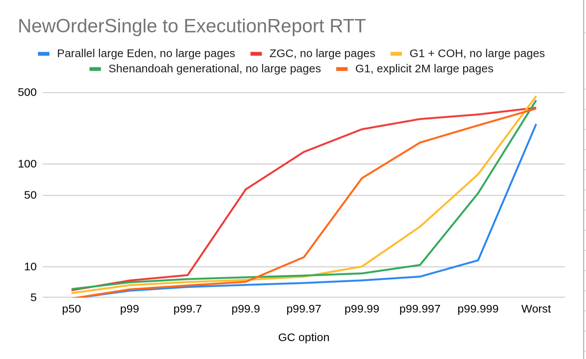
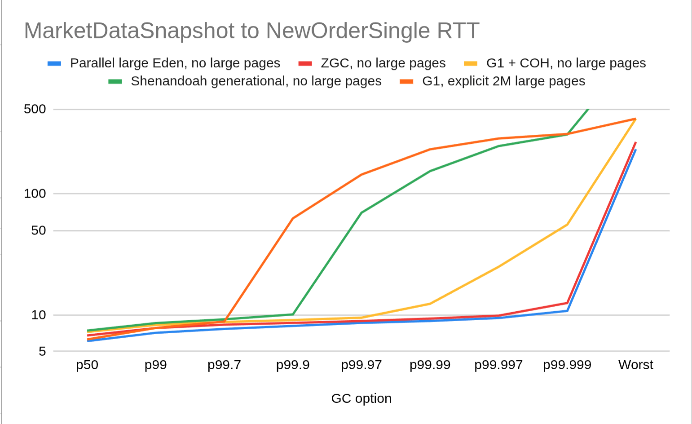

= Testing Java Memory Management with Chronicle-FIX using AI

While I am sceptical of using AI for release code, it has plenty of uses that previously weren’t practical, such as determining how easy your software is to use. If an AI can “figure it out” with a few hints, then you are on the right track. For me, the value of AI is what you learn using it.

== What AI Does Well and What It Doesn’t
Claude and Codex are effective for producing idiomatic code; for low-latency code, it needs a significant body of example code. In this case, it was able to utilise sample code for benchmarks. If it was being used to write business logic, it would need the code to be mostly complete examples, and then it could write variations on that. If you were starting, it would be better to either; a) get it to write something functionally correct with the expectation you would rewrite it again manually, or b) write the code yourself and use AI to assist you in improving it.

== The AI Benchmark Trial
I gave Codex (GPT-5.5) the task of writing a JLBH benchmark for Chronicle-FIX from documentation and sample code, testing the round-trip latency of W -> D and D -> 8 messages. The throughput is 50K/s each way. The W market data message is ~512 bytes, and the D new order signal and ‘8’ execution reports are a small ~160 bytes. The test is run for 15 minutes each.
I verified the benchmark was written but avoided hand-tuning it; then I asked it to trial different GC options, expecting they wouldn’t make much difference, since the application is low GC; however, there might still be some difference.
The system is using Java 25.0.2 on a Ryzen 9 9955HX3D with 64 GiB of RAM in a laptop running Ubuntu 24.04.04 LTS.

== The Results
The half-round-trip time (RTT/2) was between 2.4 and 3.7 microseconds. For the recommended Parallel GC, the 99.999% was ~11 microseconds. This is a great starting point considering this doesn't involve *any* hand-tuning of the code. The AI is able to do this because there are many relevant examples to draw on, and the code is relatively simple.

When it comes to the crucial business logic, you would either need to assume all the AI-generated code would be rewritten once you have it working, or write most of it yourself and use AI to assist.
Having to rewrite AI code might seem like a waste of time, however, it's much easier to write the release code from scratch once you have comprehensive test coverage and documentation of what you need it to do.

== Caveats

As with all synthetic benchmarks, there are caveats. The most important thing is that there is no business logic, and you can expect that to be an order of magnitude more complex and longer.

Another key assumption is that timings are regularly spaced. However, in reality, there are bursts of activity which disproportionally impact your profit and loss. You can lose the most money when the market is most volatile, i.e., the most active. While you might not need a sustained 50K/s throughput, you are likely to care about a burst of 50 in one millisecond.

== Notes
The vertical scale is logarithmic in microseconds.

- In the 15-minute run, only a few of the GC options resulted in any GC. Most didn’t.
- Within the margin of error, up to the 99.7%ile, different GCs were essentially the same.
- Where GC selection varied, it was around the GC waking up to see if anything needed to be done and discovering not much.
- The parallel collector is still the best in cases where you don’t expect to be collecting.
- The min/max heap size was 4000 MB, and the eden size was 3000 MB for generational collectors.
- G1+COH includes Compact Object Headers.
- In general, large pages didn’t help. This was clearer in other tests not reported here.

== Conclusion

There are sufficient resources for AI to write a benchmark that is close to what you would write yourself, and it can be a good starting point. However, you should expect to rewrite the release code once you have it working, and you should expect to spend significantly more time on documentation and testing than you would have without AI in your workflow.

Before AI, we would have to guess and rely on user feedback to determine whether the software was easy to use. Now we can use AI to trial new functionality, and if it can figure it out with a few hints, then we are on the right track. The value of AI is what you learn using it, not the code it produces.

In terms of garbage collectors, it’s not so important as the code is so low-garbage that it doesn’t rely on it, and if anything, you want to avoid disturbing the application when it’s running. It is still needed to avoid an out-of-memory error if something goes wrong.
